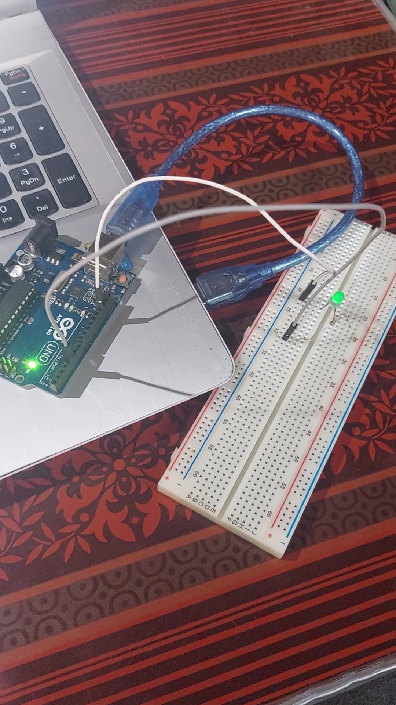
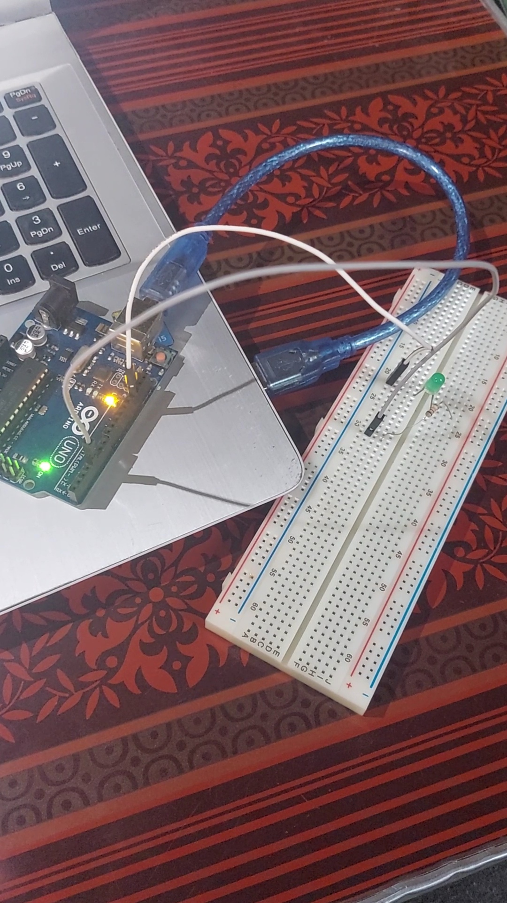

# Switch-Led-Blink
Simple C code for switching blinking between two LEDs  using Arduino

* Author Name : Mohamed Abdullah
* Author links :   
<ol>
  <li>github: https://github.com/MohamedAbdullah55</li>
  <li>linkedin:  https://www.linkedin.com/in/mohamedabdullahkamel/</li>
  <li>kaggle:  https://www.kaggle.com/mohamedabdullah</li>
</ol>
                                      
* Version : v.1.0
* Organization : ML-Island

Good Luck 😊
